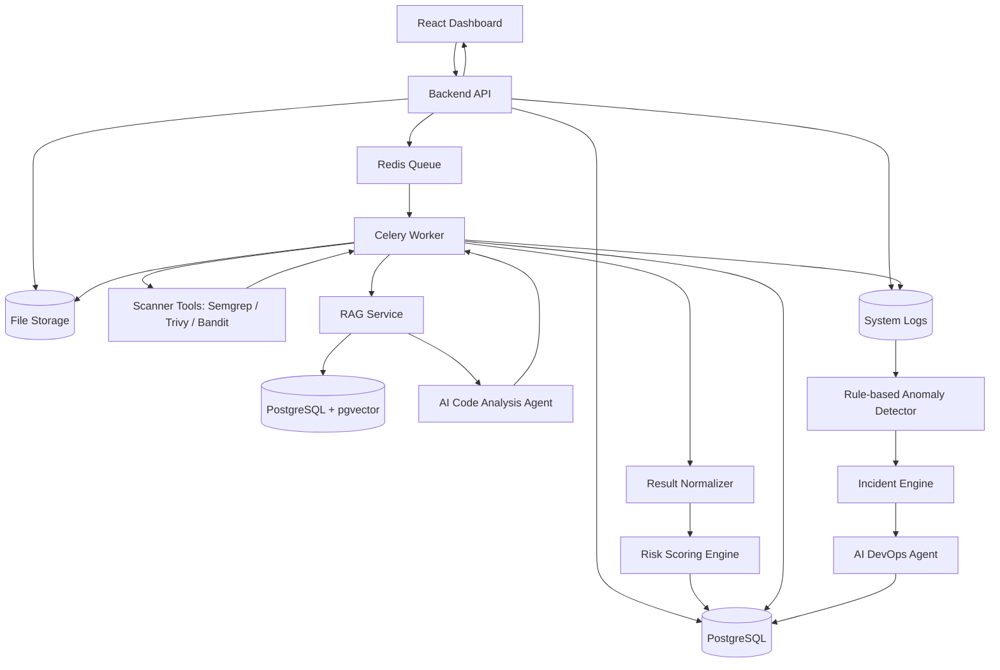

# System Architecture

## Overview

AI DevSecOps Platform is designed as a modular system with three main flows:

1. Source code analysis flow.
2. AI/RAG remediation flow.
3. Log and system anomaly analysis flow.

## High-level architecture



## Components

### Frontend

The frontend provides:

- Login/register pages.
- Project dashboard.
- Source upload UI.
- Scan job status view.
- Findings table.
- AI remediation report view.
- DevOps incident dashboard.

### Backend API

The backend API handles:

- User authentication.
- Project management.
- Source upload metadata.
- Scan job creation.
- Fetching scan results.
- Fetching AI reports and incidents.

### File Storage

Uploaded source code is stored in file storage. The database stores only metadata and paths.

For MVP, local storage is acceptable. Later versions may use S3 or MinIO.

### Worker Layer

The worker is responsible for long-running tasks:

- Extract uploaded source code.
- Run scanner tools.
- Normalize scanner output.
- Calculate risk score.
- Generate AI reports.
- Analyze logs and incidents.

### Scanner Tools

The scanner layer uses existing security tools as engines:

- Semgrep for static application security testing.
- Trivy or npm audit for dependency risk scanning.
- Bandit for Python security scanning.

### AI Code Analysis Agent

The AI Code Analysis Agent receives normalized findings and generates:

- Explanation of risk.
- Possible impact.
- Recommended remediation.
- Priority order.
- References from the security knowledge base.

### RAG Knowledge Base

The knowledge base stores:

- OWASP/CWE notes.
- Secure coding guidelines.
- Vulnerable and secure code examples.
- Fix patterns.

Embeddings are stored using PostgreSQL + pgvector.

### AI DevOps Agent

The AI DevOps Agent analyzes:

- Backend logs.
- Worker logs.
- Scanner failure logs.
- Queue backlog signals.
- Long-running jobs.

It generates incident summaries and suggested operational actions.

## Main scan job lifecycle

```text
PENDING
→ EXTRACTING
→ RUNNING_SCANNER
→ NORMALIZING
→ GENERATING_AI_REPORT
→ COMPLETED
```

Failure state:

```text
FAILED
```

## MVP boundary
User upload source code
        ↓
Backend nhận file zip
        ↓
Worker giải nén source
        ↓
Detect ngôn ngữ/framework
        ↓
Chạy Semgrep/Trivy theo loại project
        ↓
Chuẩn hóa findings
        ↓
LangChain + RAG lấy tài liệu phù hợp
        ↓
AI Agent sinh báo cáo theo ngôn ngữ/framework

The MVP should not run untrusted user applications directly. It should focus on static source code analysis and dependency scanning.

Runtime scanning, Docker sandbox, OWASP ZAP, Kubernetes, and auto-remediation should be future work.
