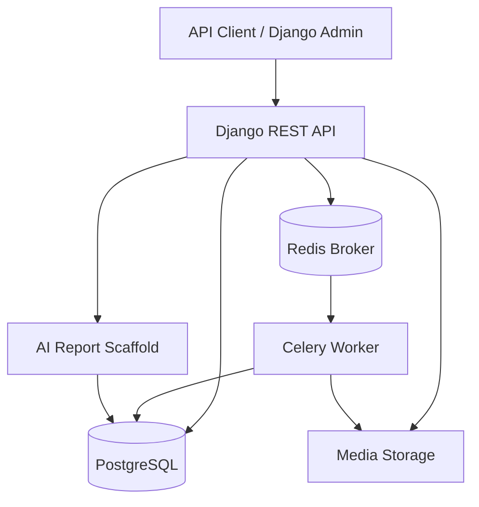
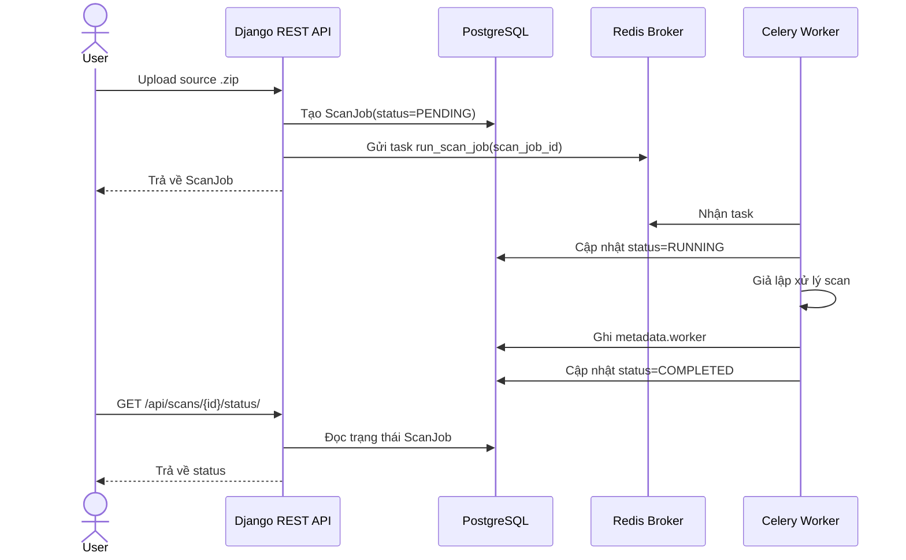
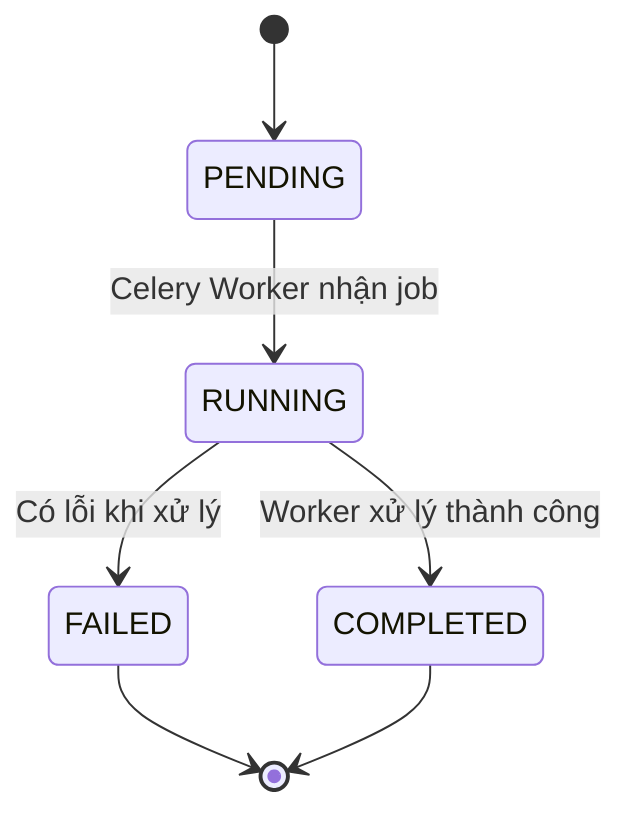

# Báo cáo hiện trạng triển khai hệ thống AI DevSecOps Platform

## Mục đích tài liệu

Tài liệu này ghi nhận hiện trạng triển khai của hệ thống **AI DevSecOps Platform** tại thời điểm hiện tại. Nội dung chỉ tập trung vào các thành phần đã được xây dựng, đã có trong mã nguồn hoặc đã được kiểm thử chạy thực tế ở mức MVP.

Tài liệu được trình bày theo cấu trúc báo cáo đồ án gồm: tổng quan đề tài, cơ sở lý thuyết, hệ thống đã triển khai và kết luận hiện trạng.

---

# Chương 1. Tổng quan đề tài

## 1.1. Giới thiệu đề tài

**AI DevSecOps Platform** là hệ thống web backend hỗ trợ quản lý project, upload source code dạng `.zip`, tạo scan job và xử lý scan job theo cơ chế bất đồng bộ bằng Celery Worker.

Ở trạng thái hiện tại, hệ thống đã có nền tảng backend để quản lý dữ liệu chính của bài toán, bao gồm người dùng, project, scan job, finding bảo mật, báo cáo AI và kho tri thức phục vụ cho hướng phát triển RAG sau này.

Hệ thống hiện đã chạy được một luồng MVP cơ bản:

```text
User tạo project
→ User upload source code dạng .zip
→ Backend tạo ScanJob với trạng thái PENDING
→ ScanJob được đẩy vào Redis/Celery
→ Celery Worker nhận job
→ Worker chuyển trạng thái RUNNING
→ Worker giả lập xử lý scan
→ Worker chuyển trạng thái COMPLETED
→ Metadata của scan job được cập nhật trong database
```

## 1.2. Lý do chọn đề tài

Trong quá trình phát triển phần mềm, việc phát hiện sớm các rủi ro bảo mật trong source code là một phần quan trọng của DevSecOps. Tuy nhiên, kết quả từ các công cụ scanner thường mang tính kỹ thuật, khó đọc đối với người mới hoặc người không chuyên sâu về bảo mật.

Đề tài hướng đến việc xây dựng một nền tảng hỗ trợ quy trình kiểm tra bảo mật source code, lưu trữ kết quả scan và từng bước bổ sung khả năng sinh báo cáo dễ hiểu bằng AI.

Ở giai đoạn hiện tại, đề tài đã tập trung xây dựng phần nền backend, mô hình dữ liệu, API upload scan job và worker xử lý bất đồng bộ.

## 1.3. Phát biểu bài toán

Bài toán hiện tại được triển khai ở mức MVP backend:

- Người dùng có thể tạo project.
- Người dùng có thể upload source code dạng `.zip`.
- Hệ thống tạo một `ScanJob` tương ứng với lần upload.
- Hệ thống đưa `ScanJob` vào hàng đợi xử lý bất đồng bộ.
- Celery Worker nhận và xử lý scan job ở chế độ mô phỏng.
- Hệ thống cập nhật trạng thái xử lý của scan job.
- Hệ thống có scaffold cho báo cáo AI dựa trên `ScanFinding` hoặc dữ liệu findings mẫu.

Đầu vào hiện tại:

```text
Project ID
File source code dạng .zip
Loại scan: SAST, DEPENDENCY hoặc FULL
```

Đầu ra hiện tại:

```text
ScanJob được tạo trong database
Trạng thái ScanJob được cập nhật
Metadata worker được lưu lại
AIReport có thể được tạo ở mức scaffold/mock
```

## 1.4. Mục tiêu đã thực hiện

Các mục tiêu đã thực hiện gồm:

- Xây dựng backend Django REST Framework.
- Xây dựng các model chính cho hệ thống.
- Tạo API quản lý project.
- Tạo API upload source code dạng `.zip`.
- Tạo `ScanJob` với trạng thái ban đầu `PENDING`.
- Cấu hình Redis làm message broker.
- Cấu hình Celery Worker.
- Tạo task `run_scan_job` để xử lý scan job bất đồng bộ.
- Worker cập nhật trạng thái `RUNNING`, `COMPLETED` hoặc `FAILED`.
- Worker ghi metadata xử lý vào `ScanJob.metadata`.
- Tạo scaffold cho AI Report Service.
- Tạo API generate và read AI report theo `scan_job_id`.

## 1.5. Phạm vi hiện tại

Phạm vi hiện tại của hệ thống bao gồm backend MVP và worker simulation.

Các phần đã có trong phạm vi hiện tại:

- Django backend.
- PostgreSQL database.
- Redis message broker.
- Celery Worker.
- Project API.
- Scan upload API.
- Scan status API.
- AI Report scaffold API.
- Các model nghiệp vụ chính.
- Tài liệu thiết kế trong thư mục `docs/`.

Tài liệu này chỉ ghi nhận các phần đã có và đã được triển khai ở mức hiện tại.

## 1.6. Phương pháp thực hiện

Quá trình thực hiện hiện tại sử dụng các phương pháp sau:

### Phương pháp phân tích và thiết kế hệ thống

Hệ thống được phân tích theo hướng tách các thành phần chính:

- User quản lý project.
- Project chứa nhiều scan job.
- ScanJob đại diện cho một lần scan.
- ScanFinding đại diện cho một finding bảo mật.
- AIReport đại diện cho báo cáo sinh từ kết quả scan.
- KnowledgeDocument và KnowledgeChunk đại diện cho kho tri thức phục vụ RAG.

Các tài liệu thiết kế đã được đặt trong thư mục `docs/`, bao gồm C4, use case, database design và system diagrams.

### Phương pháp phát triển hệ thống

Dự án được phát triển theo từng nhánh tính năng nhỏ:

- Xây dựng model và database trước.
- Xây dựng API quản lý project.
- Xây dựng API upload scan job.
- Bổ sung Celery Worker simulation.
- Bổ sung scaffold cho AI Report.

### Phương pháp cài đặt và kiểm thử

Hệ thống được kiểm thử ở môi trường local:

- Django server chạy tại `http://127.0.0.1:8000/`.
- Redis chạy bằng Docker container.
- Celery Worker chạy với chế độ Windows `-P solo`.
- Upload file `.zip` thành công.
- ScanJob được xử lý từ `PENDING` sang `COMPLETED`.
- Metadata worker được ghi vào database.

## 1.7. Tài liệu liên quan trong repo

Các tài liệu hiện có trong thư mục `docs/` gồm:

- `docs/C4.md`
- `docs/database-design.md`
- `docs/use-case.md`
- `docs/diagrams.md`
- `docs/adr/`
- `docs/development-plan.md`
- `docs/github-workflow.md`

## 1.8. Bố cục tài liệu

Tài liệu này gồm bốn chương:

- Chương 1 trình bày tổng quan đề tài và phạm vi hiện tại.
- Chương 2 trình bày các khái niệm và công nghệ đã sử dụng.
- Chương 3 trình bày hệ thống đã triển khai.
- Chương 4 tổng kết hiện trạng đã hoàn thành.

---

# Chương 2. Cơ sở lý thuyết

## 2.1. Các khái niệm nền tảng liên quan bài toán

### DevSecOps

DevSecOps là cách tiếp cận đưa hoạt động bảo mật vào quy trình phát triển và vận hành phần mềm. Trong đề tài này, DevSecOps được thể hiện qua việc xây dựng hệ thống có khả năng tiếp nhận source code, tạo scan job và chuẩn bị nền tảng xử lý kết quả bảo mật.

### Scan Job

`ScanJob` là đối tượng đại diện cho một lần xử lý source code được upload lên hệ thống. Mỗi `ScanJob` gắn với một project, một người tạo, một file source upload và trạng thái xử lý.

Các trạng thái hiện có của `ScanJob`:

```text
PENDING
RUNNING
COMPLETED
FAILED
```

### Scan Finding

`ScanFinding` là đối tượng đại diện cho một lỗi hoặc rủi ro bảo mật được phát hiện trong quá trình scan. Ở trạng thái hiện tại, model `ScanFinding` đã có trong hệ thống để sẵn sàng lưu findings khi scanner thật được tích hợp.

Các mức độ nghiêm trọng hiện có:

```text
INFO
LOW
MEDIUM
HIGH
CRITICAL
```

Các trạng thái xử lý finding hiện có:

```text
OPEN
FIXED
IGNORED
```

### AI Report

`AIReport` là đối tượng lưu báo cáo phân tích bảo mật ở dạng dễ hiểu hơn cho người dùng. Ở trạng thái hiện tại, hệ thống đã có scaffold cho AI report, có thể tạo báo cáo từ `ScanFinding` nếu có, hoặc từ mock findings để kiểm thử luồng xử lý.

### Knowledge Document và Knowledge Chunk

`KnowledgeDocument` là tài liệu tri thức phục vụ cho hướng phát triển RAG. Một tài liệu có thể được chia thành nhiều `KnowledgeChunk`. Ở trạng thái hiện tại, các model này đã có trong database design và backend, nhưng phần truy xuất RAG thật chưa được triển khai trong phạm vi hiện tại của tài liệu này.

### Xử lý bất đồng bộ

Xử lý bất đồng bộ được sử dụng để tránh việc request upload source code phải chờ toàn bộ quá trình scan hoàn tất. Hệ thống hiện dùng Redis làm message broker và Celery Worker làm tiến trình xử lý nền.

## 2.2. Mô hình và phương pháp đã áp dụng

Các mô hình và phương pháp đã áp dụng gồm:

- Mô hình web backend API.
- Mô hình xử lý bất đồng bộ với queue.
- Mô hình dữ liệu quan hệ.
- Mô hình hóa hệ thống bằng C4, use case, ERD và UML.
- Tách service xử lý nghiệp vụ ra khỏi model và API view khi cần thiết.

## 2.3. Công nghệ đã sử dụng

### Django REST Framework

Django REST Framework được sử dụng để xây dựng backend API cho hệ thống. Các API hiện tại phục vụ quản lý project, upload scan job, kiểm tra trạng thái scan và thao tác với AI report scaffold.

### PostgreSQL

PostgreSQL được sử dụng làm hệ quản trị cơ sở dữ liệu chính. Các bảng dữ liệu hiện tại lưu thông tin user, project, scan job, scan finding, AI report và knowledge base.

### Redis

Redis được sử dụng làm message broker cho Celery. Trong môi trường kiểm thử local, Redis đã được chạy bằng Docker container và mở cổng `6379`.

### Celery

Celery được sử dụng để xử lý scan job bất đồng bộ. Worker hiện đã nhận task `scans.tasks.run_scan_job`, cập nhật trạng thái scan job và ghi metadata xử lý vào database.

### Docker

Docker hiện được sử dụng để chạy Redis trong môi trường local. Redis container đã được dùng để kiểm thử luồng Celery Worker.

### GitHub

GitHub được sử dụng để quản lý mã nguồn, branch, pull request và tài liệu phát triển.

## 2.4. Vai trò của công nghệ trong hệ thống hiện tại

| Công nghệ | Vai trò hiện tại |
|---|---|
| Django REST Framework | Xây dựng backend API |
| PostgreSQL | Lưu dữ liệu nghiệp vụ |
| Redis | Message broker cho Celery |
| Celery | Xử lý scan job bất đồng bộ |
| Docker | Chạy Redis ở môi trường local |
| Markdown | Viết tài liệu dự án |
| Mermaid | Mô tả sơ đồ trong tài liệu |

---

# Chương 3. Hệ thống đã triển khai

## 3.1. Giới thiệu hệ thống hiện tại

Hệ thống hiện tại là backend MVP cho nền tảng AI DevSecOps Platform. Người dùng có thể tạo project, upload source code dạng `.zip`, tạo scan job và theo dõi trạng thái xử lý.

Luồng xử lý đã chạy được:

```text
API Client
→ Django REST API
→ PostgreSQL
→ Redis Queue
→ Celery Worker
→ PostgreSQL
```

## 3.2. Kiến trúc hệ thống hiện tại

### 3.2.1. Kiến trúc tổng thể hệ thống

Kiến trúc hiện tại gồm các thành phần đã triển khai:



### 3.2.2. Các thành phần của kiến trúc

#### Django REST API

Django REST API là thành phần tiếp nhận request từ người dùng hoặc API client. API hiện xử lý các nghiệp vụ như tạo project, upload source code và tạo scan job.

#### PostgreSQL

PostgreSQL lưu trữ dữ liệu của hệ thống, bao gồm project, scan job, finding, AI report và knowledge base.

#### Media Storage

Media Storage lưu file source code `.zip` do người dùng upload. File được lưu thông qua field `source_file` của `ScanJob`.

#### Redis Broker

Redis làm hàng đợi trung gian giữa Django API và Celery Worker. Khi một scan job được tạo, backend gọi Celery task và Redis giữ nhiệm vụ broker cho task đó.

#### Celery Worker

Celery Worker nhận `scan_job_id`, đọc `ScanJob` từ database, cập nhật trạng thái xử lý và ghi metadata. Ở trạng thái hiện tại, worker đang xử lý ở chế độ simulation.

#### AI Report Scaffold

AI Report Scaffold cho phép tạo báo cáo AI ở mức mock/deterministic report. Service hiện lấy `ScanFinding` nếu có, hoặc dùng mock findings để tạo `AIReport`.

## 3.2.3. Luồng xử lý tổng quát đã có

Luồng xử lý scan job hiện tại:

```text
1. User hoặc API client gửi request upload file .zip.
2. Django REST API validate file upload.
3. Backend tạo ScanJob với status = PENDING.
4. Backend lưu tên file upload vào ScanJob.metadata.source_file_name.
5. Backend gọi run_scan_job.delay(scan_job.id).
6. Redis nhận task.
7. Celery Worker nhận task run_scan_job.
8. Worker cập nhật ScanJob.status = RUNNING.
9. Worker giả lập quá trình xử lý.
10. Worker ghi metadata.worker vào ScanJob.metadata.
11. Worker cập nhật ScanJob.status = COMPLETED.
12. Người dùng gọi API status để kiểm tra trạng thái.
```

## 3.3. Phân tích use case đã có

### 3.3.1. Danh sách use case hiện tại

Các use case đã có ở mức backend:

| Use case | Actor | Kết quả hiện tại |
|---|---|---|
| Tạo project | User | Project được lưu vào database |
| Xem danh sách project | User | Trả về danh sách project của user |
| Upload source code `.zip` | User | Tạo ScanJob với status `PENDING` |
| Xem trạng thái scan job | User | Trả về trạng thái hiện tại của ScanJob |
| Xử lý scan job bằng worker | Celery Worker | ScanJob được chuyển sang `RUNNING` rồi `COMPLETED` |
| Generate AI report scaffold | User | Tạo AIReport từ findings hoặc mock findings |
| Xem AI report | User | Trả về AIReport theo scan_job_id |
| Quản trị dữ liệu qua Django Admin | Admin | Quản lý dữ liệu model trong admin |

### 3.3.2. Đặc tả use case: Upload source code và tạo ScanJob

| Tên trường | Nội dung |
|---|---|
| Use case Id | UC-01 |
| Tên use case | Upload source code và tạo ScanJob |
| Actor chính | User |
| Mô tả vắn tắt | User upload file `.zip`, hệ thống tạo một ScanJob mới |
| Tiền điều kiện | User đã đăng nhập và đã có Project |
| Hậu điều kiện | ScanJob được tạo với trạng thái `PENDING` |
| Luồng hoạt động | User gửi request upload file `.zip`; backend validate file; backend tạo ScanJob; backend gọi Celery task |
| Luồng thay thế | Nếu file không phải `.zip`, hệ thống trả lỗi validation |
| Kết quả | ScanJob được lưu vào database và được đưa vào queue xử lý |

### 3.3.3. Đặc tả use case: Worker xử lý ScanJob

| Tên trường | Nội dung |
|---|---|
| Use case Id | UC-02 |
| Tên use case | Worker xử lý ScanJob |
| Actor chính | Celery Worker |
| Mô tả vắn tắt | Worker nhận scan_job_id và cập nhật trạng thái xử lý |
| Tiền điều kiện | ScanJob đã được tạo và task đã được đưa vào Redis |
| Hậu điều kiện | ScanJob có trạng thái `COMPLETED` hoặc `FAILED` |
| Luồng hoạt động | Worker nhận task; đọc ScanJob; cập nhật RUNNING; xử lý simulation; ghi metadata; cập nhật COMPLETED |
| Luồng ngoại lệ | Nếu có lỗi khi xử lý, worker cập nhật status `FAILED` và lưu `error_message` |
| Kết quả | Trạng thái ScanJob được cập nhật trong database |

### 3.3.4. Đặc tả use case: Generate AI Report Scaffold

| Tên trường | Nội dung |
|---|---|
| Use case Id | UC-03 |
| Tên use case | Generate AI Report Scaffold |
| Actor chính | User |
| Mô tả vắn tắt | User gọi API để tạo AIReport cho một ScanJob |
| Tiền điều kiện | ScanJob tồn tại và user có quyền truy cập |
| Hậu điều kiện | AIReport được tạo hoặc cập nhật |
| Luồng hoạt động | API lấy ScanJob; service lấy ScanFinding nếu có; nếu chưa có thì dùng mock findings; tạo report_json; lưu AIReport |
| Kết quả | AIReport được lưu trong database |

## 3.4. Mô hình hóa hệ thống

### 3.4.1. Sơ đồ lớp ở mức entity

Các entity chính hiện có:

```text
User
Project
ScanJob
ScanFinding
AIReport
KnowledgeDocument
KnowledgeChunk
```

Quan hệ chính:

```text
User 1 - n Project
User 1 - n ScanJob
Project 1 - n ScanJob
ScanJob 1 - n ScanFinding
ScanJob 1 - 1 AIReport
KnowledgeDocument 1 - n KnowledgeChunk
```

### 3.4.2. Sơ đồ tuần tự luồng ScanJob hiện tại



### 3.4.3. Sơ đồ trạng thái ScanJob hiện tại



## 3.5. Thiết kế cơ sở dữ liệu hệ thống

### 3.5.1. Các bảng dữ liệu chính hiện có

| Bảng | Model | Vai trò |
|---|---|---|
| `accounts_user` | User | Lưu người dùng hệ thống |
| `projects_project` | Project | Lưu project của user |
| `scans_scan_job` | ScanJob | Lưu một lần scan source code |
| `findings_scan_finding` | ScanFinding | Lưu finding bảo mật |
| `ai_agents_ai_report` | AIReport | Lưu báo cáo AI |
| `knowledge_base_document` | KnowledgeDocument | Lưu tài liệu tri thức |
| `knowledge_base_chunk` | KnowledgeChunk | Lưu đoạn nhỏ của tài liệu tri thức |

### 3.5.2. Các quan hệ quan trọng

| Quan hệ | Ý nghĩa |
|---|---|
| User - Project | Một user có thể sở hữu nhiều project |
| User - ScanJob | Một user có thể tạo nhiều scan job |
| Project - ScanJob | Một project có thể được scan nhiều lần |
| ScanJob - ScanFinding | Một scan job có thể có nhiều finding |
| ScanJob - AIReport | Một scan job có một báo cáo AI |
| KnowledgeDocument - KnowledgeChunk | Một tài liệu tri thức được chia thành nhiều chunk |

### 3.5.3. Các ràng buộc dữ liệu hiện có

Các ràng buộc dữ liệu hiện tại:

- `ScanJob.status` chỉ nhận các giá trị: `PENDING`, `RUNNING`, `COMPLETED`, `FAILED`.
- `ScanJob.scan_type` chỉ nhận các giá trị: `SAST`, `DEPENDENCY`, `FULL`.
- `ScanFinding.severity` chỉ nhận các giá trị: `INFO`, `LOW`, `MEDIUM`, `HIGH`, `CRITICAL`.
- `ScanFinding.status` chỉ nhận các giá trị: `OPEN`, `FIXED`, `IGNORED`.
- `AIReport` liên kết một-một với `ScanJob`.
- `Project` thuộc về một `User`.
- File upload của `ScanJob` được validate là file `.zip`.

## 3.6. API hiện có

### 3.6.1. Project API

API project hiện dùng để tạo và xem project của user.

```text
/api/projects/
```

### 3.6.2. Scan API

API scan hiện dùng để upload source code `.zip`, tạo scan job và kiểm tra trạng thái scan job.

```text
POST /api/scans/
GET  /api/scans/
GET  /api/scans/{id}/
GET  /api/scans/{id}/status/
```

### 3.6.3. AI Report API Scaffold

API AI Report hiện dùng để tạo và xem báo cáo AI ở mức scaffold.

```text
POST /api/ai-reports/scans/{scan_job_id}/generate/
GET  /api/ai-reports/scans/{scan_job_id}/
```

## 3.7. Kết quả triển khai hệ thống

### 3.7.1. Môi trường chạy thực tế hiện tại

Hệ thống đã được chạy ở môi trường local với các thành phần:

| Thành phần | Trạng thái |
|---|---|
| Redis Docker container | Đã chạy |
| Django server | Đã chạy tại `http://127.0.0.1:8000/` |
| Django Admin | Đã chạy tại `http://127.0.0.1:8000/admin/` |
| Celery Worker | Đã chạy với Windows mode `-P solo` |
| Celery task | Đã nhận diện task `scans.tasks.run_scan_job` |

### 3.7.2. Kết quả kiểm thử flow scan job

Flow đã được kiểm thử:

```text
Tạo user test
→ Tạo Project qua API
→ Tạo file test-source.zip
→ Upload file .zip
→ Tạo scan_job_id
→ Celery Worker xử lý task
→ ScanJob chuyển sang COMPLETED
→ Metadata worker được ghi vào database
```

Kết quả status sau khi worker xử lý:

```json
{
  "scan_job_id": 1,
  "status": "COMPLETED",
  "error_message": null
}
```

Metadata sau khi worker xử lý:

```json
{
  "source_file_name": "test-source.zip",
  "worker": {
    "processed": true,
    "mode": "simulation",
    "message": "Celery worker processed this scan job successfully."
  }
}
```

### 3.7.3. Chức năng đã hoàn thành

Các chức năng đã hoàn thành ở mức hiện tại:

- Khởi tạo backend Django.
- Cấu hình Django REST Framework.
- Cấu hình PostgreSQL.
- Xây dựng model `Project`.
- Xây dựng model `ScanJob`.
- Xây dựng model `ScanFinding`.
- Xây dựng model `AIReport`.
- Xây dựng model `KnowledgeDocument`.
- Xây dựng model `KnowledgeChunk`.
- Tạo API project.
- Tạo API upload source code `.zip`.
- Validate file upload phải là `.zip`.
- Tạo `ScanJob` với trạng thái `PENDING`.
- Cấu hình Redis làm broker.
- Cấu hình Celery app.
- Tạo Celery task `run_scan_job`.
- Worker cập nhật trạng thái `RUNNING`.
- Worker cập nhật trạng thái `COMPLETED`.
- Worker cập nhật trạng thái `FAILED` khi có lỗi.
- Worker ghi metadata xử lý vào database.
- Tạo scaffold cho AI Report Service.
- Tạo API generate AI report.
- Tạo API đọc AI report theo scan job.
- Viết tài liệu kiến trúc và mô hình hóa hệ thống trong thư mục `docs/`.

---

# Chương 4. Kết luận

## 4.1. Kết luận hiện trạng

Ở trạng thái hiện tại, hệ thống **AI DevSecOps Platform** đã hoàn thành phần nền tảng backend MVP. Hệ thống đã có các model chính, API quản lý project, API upload source code, cơ chế tạo scan job và worker bất đồng bộ bằng Celery.

Kết quả quan trọng nhất đã đạt được là hệ thống chạy được luồng xử lý bất đồng bộ:

```text
Upload .zip
→ Tạo ScanJob(PENDING)
→ Đẩy task vào Redis/Celery
→ Worker nhận task
→ Cập nhật RUNNING
→ Xử lý simulation
→ Cập nhật COMPLETED
```

Ngoài ra, hệ thống đã có scaffold cho AI Report để chuẩn bị cho bước sinh báo cáo phân tích bảo mật ở các giai đoạn tiếp theo. Ở phạm vi tài liệu này, AI Report mới dừng ở mức scaffold/mock report, dùng để kiểm thử luồng lưu báo cáo vào database.

## 4.2. Giá trị đã đạt được

Các giá trị đã đạt được:

- Có nền tảng backend rõ ràng cho hệ thống DevSecOps.
- Có mô hình dữ liệu đủ để mở rộng scan và báo cáo sau này.
- Có luồng upload source code và tạo scan job.
- Có worker xử lý bất đồng bộ hoạt động thực tế.
- Có cơ chế theo dõi trạng thái scan job.
- Có metadata ghi nhận quá trình xử lý của worker.
- Có scaffold cho AI report.
- Có tài liệu thiết kế hệ thống trong thư mục `docs/`.

Tài liệu này ghi nhận phần đã hoàn thành của hệ thống ở thời điểm hiện tại.
