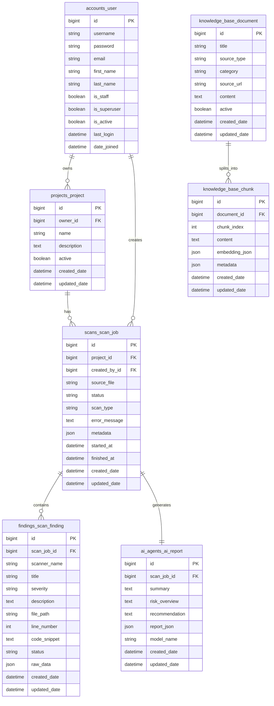

# Thiết kế cơ sở dữ liệu

Tài liệu này mô tả thiết kế cơ sở dữ liệu MVP của **AI DevSecOps Platform** dựa trên các model hiện có trong backend. Mục tiêu là giữ schema đủ đơn giản để triển khai, nhưng vẫn hỗ trợ được luồng chính: tạo project, upload source code, tạo scan job, lưu findings, lưu AI report và quản lý knowledge base phục vụ RAG.

---

## 1. Nguyên tắc thiết kế

- Chỉ tạo các bảng cần thiết cho luồng nghiệp vụ chính của MVP.
- Không thêm field nếu chưa có nhu cầu sử dụng thật trong backend.
- Các trường dùng chung như `created_date`, `updated_date`, `active` được kế thừa từ abstract model trong app `common`.
- Dữ liệu linh hoạt hoặc dữ liệu phụ từ scanner/AI được lưu bằng `JSONField`.
- Kết quả scanner được chuẩn hóa về bảng `ScanFinding`.
- Báo cáo AI được tách riêng ở bảng `AIReport` và liên kết 1-1 với `ScanJob`.
- Knowledge base phục vụ RAG được tách thành `KnowledgeDocument` và `KnowledgeChunk`.

---

## 2. Abstract model dùng chung

Backend hiện có 2 abstract model dùng chung:

### 2.1. `TimeStampedModel`

| Trường | Kiểu dữ liệu | Ý nghĩa |
|---|---|---|
| `created_date` | DateTime | Thời gian tạo bản ghi |
| `updated_date` | DateTime | Thời gian cập nhật bản ghi |

Các model kế thừa `TimeStampedModel`:

```text
ScanJob
ScanFinding
AIReport
KnowledgeChunk
```

### 2.2. `ActiveTimeStampedModel`

`ActiveTimeStampedModel` kế thừa `TimeStampedModel` và bổ sung field:

| Trường | Kiểu dữ liệu | Ý nghĩa |
|---|---|---|
| `active` | Boolean | Trạng thái hoạt động, dùng cho soft delete hoặc ẩn dữ liệu |

Các model kế thừa `ActiveTimeStampedModel`:

```text
Project
KnowledgeDocument
```

---

## 3. Các trường JSON chính

| Bảng | Trường JSON | Mục đích |
|---|---|---|
| `scans_scan_job` | `metadata` | Lưu tên file upload, đường dẫn giải nén, detected stack, số lượng findings, security score, risk level và thông tin scanner |
| `findings_scan_finding` | `raw_data` | Lưu dữ liệu gốc từ Semgrep, Trivy hoặc npm audit |
| `ai_agents_ai_report` | `report_json` | Lưu cấu trúc chi tiết của báo cáo AI |
| `knowledge_base_chunk` | `embedding_json` | Lưu embedding tạm thời trong MVP |
| `knowledge_base_chunk` | `metadata` | Lưu thông tin phụ của chunk phục vụ RAG |

Ghi chú: backend hiện chưa có field riêng cho `security_score`, `risk_level`, `detected_stack` hoặc `extract_path`. Các thông tin này nên lưu trong `ScanJob.metadata` để tránh làm schema phức tạp sớm.

Ví dụ `ScanJob.metadata`:

```json
{
  "source_file_name": "vulnerable-app.zip",
  "extract_path": "storage/scans/1/extracted",
  "detected_stack": {
    "primary_language": "Python",
    "framework": "Django",
    "package_manager": "pip",
    "confidence": 0.9
  },
  "severity_count": {
    "critical": 1,
    "high": 2,
    "medium": 4,
    "low": 3,
    "info": 0
  },
  "total_findings": 10,
  "security_score": 65,
  "risk_level": "MEDIUM"
}
```

---

## 4. Danh sách bảng chính

### 4.1. `accounts_user`

Bảng lưu thông tin người dùng hệ thống. Model `User` kế thừa `AbstractUser` của Django và sử dụng `db_table = "accounts_user"`.

Các field quan trọng:

| Trường | Kiểu dữ liệu | Ý nghĩa |
|---|---|---|
| `id` | BigInt | Khóa chính |
| `username` | String | Tên đăng nhập |
| `password` | String | Mật khẩu đã được hash bởi Django |
| `email` | String | Email người dùng |
| `first_name` | String | Tên |
| `last_name` | String | Họ |
| `is_staff` | Boolean | Cho phép truy cập Django Admin |
| `is_superuser` | Boolean | Quyền quản trị cao nhất |
| `is_active` | Boolean | Trạng thái tài khoản |
| `last_login` | DateTime | Lần đăng nhập gần nhất |
| `date_joined` | DateTime | Thời gian tạo tài khoản |

Trong MVP, hệ thống chỉ phân biệt:

- **Admin**: `is_staff=True` hoặc `is_superuser=True`.
- **User thường**: `is_staff=False`, `is_superuser=False`.

Không tạo thêm field `role` riêng vì dự án hiện chỉ có Admin và User.

Ghi chú: do kế thừa `AbstractUser`, Django vẫn có các quan hệ mặc định như `groups` và `user_permissions`. Các quan hệ này không đưa vào ERD chính để giữ sơ đồ tập trung vào nghiệp vụ MVP.

---

### 4.2. `projects_project`

Bảng lưu project source code của người dùng. Model `Project` kế thừa `ActiveTimeStampedModel`.

| Trường | Kiểu dữ liệu | Ràng buộc | Ý nghĩa |
|---|---|---|---|
| `id` | BigInt | PK | Khóa chính |
| `owner_id` | BigInt | FK đến `accounts_user.id`, cascade delete | Người sở hữu project |
| `name` | String(255) | Required | Tên project |
| `description` | Text | Nullable, blank | Mô tả project |
| `active` | Boolean | Default `True` | Trạng thái hoạt động, dùng cho soft delete |
| `created_date` | DateTime | Auto add | Thời gian tạo |
| `updated_date` | DateTime | Auto update | Thời gian cập nhật |

Indexes:

```text
(owner, active)
created_date
```

Quan hệ:

```text
User 1 - n Project
```

---

### 4.3. `scans_scan_job`

Bảng lưu mỗi lần người dùng upload source code và yêu cầu hệ thống scan. Model `ScanJob` kế thừa `TimeStampedModel`.

| Trường | Kiểu dữ liệu | Ràng buộc | Ý nghĩa |
|---|---|---|---|
| `id` | BigInt | PK | Khóa chính |
| `project_id` | BigInt | FK đến `projects_project.id`, cascade delete | Project được scan |
| `created_by_id` | BigInt | FK đến `accounts_user.id`, nullable, set null | Người tạo scan job |
| `source_file` | File | Upload vào `source_uploads/` | File source code `.zip` được upload |
| `status` | String(20) | TextChoices, default `PENDING` | Trạng thái scan job |
| `scan_type` | String(20) | TextChoices, default `FULL` | Loại scan |
| `error_message` | Text | Nullable, blank | Lỗi nếu scan thất bại |
| `metadata` | JSON | Default `{}` | Thông tin phụ của scan job |
| `started_at` | DateTime | Nullable, blank | Thời gian bắt đầu xử lý |
| `finished_at` | DateTime | Nullable, blank | Thời gian hoàn tất |
| `created_date` | DateTime | Auto add | Thời gian tạo |
| `updated_date` | DateTime | Auto update | Thời gian cập nhật |

Giá trị `status`:

```text
PENDING
RUNNING
COMPLETED
FAILED
```

Giá trị `scan_type`:

```text
SAST
DEPENDENCY
FULL
```

Indexes:

```text
(project, status)
created_by
created_date
```

Quan hệ:

```text
Project 1 - n ScanJob
User 1 - n ScanJob
```

---

### 4.4. `findings_scan_finding`

Bảng lưu các lỗi/rủi ro được phát hiện bởi scanner. Model `ScanFinding` kế thừa `TimeStampedModel`.

| Trường | Kiểu dữ liệu | Ràng buộc | Ý nghĩa |
|---|---|---|---|
| `id` | BigInt | PK | Khóa chính |
| `scan_job_id` | BigInt | FK đến `scans_scan_job.id`, cascade delete | Scan job chứa finding |
| `scanner_name` | String(100) | Required | Tên scanner, ví dụ `semgrep`, `trivy`, `npm_audit` |
| `title` | String(255) | Required | Tiêu đề finding |
| `severity` | String(20) | TextChoices, default `INFO` | Mức độ nghiêm trọng |
| `description` | Text | Nullable, blank | Mô tả finding |
| `file_path` | String(500) | Nullable, blank | File bị ảnh hưởng |
| `line_number` | Integer | Nullable, blank | Dòng code liên quan |
| `code_snippet` | Text | Nullable, blank | Đoạn code liên quan |
| `status` | String(20) | TextChoices, default `OPEN` | Trạng thái xử lý finding |
| `raw_data` | JSON | Default `{}` | Dữ liệu gốc từ scanner |
| `created_date` | DateTime | Auto add | Thời gian tạo |
| `updated_date` | DateTime | Auto update | Thời gian cập nhật |

Giá trị `severity`:

```text
INFO
LOW
MEDIUM
HIGH
CRITICAL
```

Giá trị `status`:

```text
OPEN
FIXED
IGNORED
```

Indexes:

```text
(scan_job, severity)
status
scanner_name
```

Quan hệ:

```text
ScanJob 1 - n ScanFinding
```

---

### 4.5. `ai_agents_ai_report`

Bảng lưu báo cáo AI cho từng scan job. Model `AIReport` kế thừa `TimeStampedModel`.

| Trường | Kiểu dữ liệu | Ràng buộc | Ý nghĩa |
|---|---|---|---|
| `id` | BigInt | PK | Khóa chính |
| `scan_job_id` | BigInt | OneToOne đến `scans_scan_job.id`, cascade delete | Scan job được phân tích |
| `summary` | Text | Required | Tóm tắt kết quả phân tích |
| `risk_overview` | Text | Nullable, blank | Tổng quan mức độ rủi ro |
| `recommendation` | Text | Nullable, blank | Gợi ý khắc phục |
| `report_json` | JSON | Default `{}` | Báo cáo chi tiết dạng JSON |
| `model_name` | String(100) | Nullable, blank | Tên AI model sử dụng |
| `created_date` | DateTime | Auto add | Thời gian tạo |
| `updated_date` | DateTime | Auto update | Thời gian cập nhật |

Indexes:

```text
created_date
```

Quan hệ:

```text
ScanJob 1 - 1 AIReport
```

Trong MVP, mỗi `ScanJob` chỉ cần một `AIReport`. Nếu sau này cần lưu nhiều phiên bản báo cáo AI cho cùng một scan job, quan hệ này có thể đổi từ `OneToOneField` sang `ForeignKey`.

---

### 4.6. `knowledge_base_document`

Bảng lưu tài liệu dùng làm nguồn tri thức cho RAG. Model `KnowledgeDocument` kế thừa `ActiveTimeStampedModel`.

| Trường | Kiểu dữ liệu | Ràng buộc | Ý nghĩa |
|---|---|---|---|
| `id` | BigInt | PK | Khóa chính |
| `title` | String(255) | Required | Tiêu đề tài liệu |
| `source_type` | String(50) | TextChoices | Loại nguồn tài liệu |
| `category` | String(100) | Nullable, blank | Nhóm nội dung |
| `source_url` | URL | Nullable, blank | Đường dẫn tham khảo |
| `content` | Text | Required | Nội dung tài liệu |
| `active` | Boolean | Default `True` | Trạng thái hoạt động |
| `created_date` | DateTime | Auto add | Thời gian tạo |
| `updated_date` | DateTime | Auto update | Thời gian cập nhật |

Giá trị `source_type`:

```text
OWASP
CWE
SEMGREP_DOC
TRIVY_DOC
CUSTOM_NOTE
RUNBOOK
```

Indexes:

```text
(source_type, active)
category
```

Quan hệ:

```text
KnowledgeDocument 1 - n KnowledgeChunk
```

---

### 4.7. `knowledge_base_chunk`

Bảng lưu các đoạn nhỏ được tách từ `KnowledgeDocument` để phục vụ truy xuất context trong RAG. Model `KnowledgeChunk` kế thừa `TimeStampedModel`.

| Trường | Kiểu dữ liệu | Ràng buộc | Ý nghĩa |
|---|---|---|---|
| `id` | BigInt | PK | Khóa chính |
| `document_id` | BigInt | FK đến `knowledge_base_document.id`, cascade delete | Tài liệu gốc |
| `chunk_index` | Integer | Required | Thứ tự chunk trong tài liệu |
| `content` | Text | Required | Nội dung chunk |
| `embedding_json` | JSON | Default `[]` | Embedding tạm thời trong MVP |
| `metadata` | JSON | Default `{}` | Thông tin phụ của chunk |
| `created_date` | DateTime | Auto add | Thời gian tạo |
| `updated_date` | DateTime | Auto update | Thời gian cập nhật |

Indexes:

```text
(document, chunk_index)
created_date
```

Trong giai đoạn sau, `embedding_json` có thể được thay bằng vector field nếu tích hợp `pgvector`.

---

## 5. ERD tổng quát



---

## 6. Các quan hệ quan trọng

| Quan hệ | Loại | Ý nghĩa |
|---|---|---|
| `accounts_user` - `projects_project` | 1-n | Một user có thể sở hữu nhiều project |
| `accounts_user` - `scans_scan_job` | 1-n | Một user có thể tạo nhiều scan job |
| `projects_project` - `scans_scan_job` | 1-n | Một project có thể được scan nhiều lần |
| `scans_scan_job` - `findings_scan_finding` | 1-n | Một scan job có thể sinh nhiều finding |
| `scans_scan_job` - `ai_agents_ai_report` | 1-1 | Một scan job có một báo cáo AI |
| `knowledge_base_document` - `knowledge_base_chunk` | 1-n | Một tài liệu được tách thành nhiều chunk |

---

## 7. Ràng buộc dữ liệu

- `Project.owner` là khóa ngoại đến `User`, khi user bị xóa thì project bị xóa theo do `on_delete=models.CASCADE`.
- `ScanJob.project` là khóa ngoại đến `Project`, khi project bị xóa thì scan job bị xóa theo do `on_delete=models.CASCADE`.
- `ScanJob.created_by` là khóa ngoại đến `User`, có thể null; nếu user bị xóa thì field này được set null do `on_delete=models.SET_NULL`.
- `ScanFinding.scan_job` là khóa ngoại đến `ScanJob`, khi scan job bị xóa thì finding bị xóa theo.
- `AIReport.scan_job` là quan hệ 1-1 đến `ScanJob`, khi scan job bị xóa thì AI report bị xóa theo.
- `KnowledgeChunk.document` là khóa ngoại đến `KnowledgeDocument`, khi document bị xóa thì chunk bị xóa theo.
- Các trường trạng thái như `ScanJob.status`, `ScanJob.scan_type`, `ScanFinding.severity`, `ScanFinding.status`, `KnowledgeDocument.source_type` dùng `TextChoices` để giới hạn giá trị hợp lệ.
- Các bảng nghiệp vụ chính có `created_date` và `updated_date` để theo dõi thời gian tạo/cập nhật.
- `Project` và `KnowledgeDocument` có field `active` để phục vụ soft delete hoặc ẩn dữ liệu.

---

## 8. Lý do rút gọn schema MVP

Ban đầu hệ thống có thể mở rộng thêm các bảng như `SourceUpload`, `ScanStep`, `SystemLog`, `Incident`, `IncidentAIReport`, `ScannerRun` hoặc bảng riêng cho `RiskScore`. Tuy nhiên, trong giai đoạn MVP, các bảng này chưa bắt buộc vì có thể làm hệ thống phức tạp sớm.

Thiết kế hiện tại tập trung vào luồng chính:

```text
User tạo Project
Project có nhiều ScanJob
ScanJob sinh nhiều ScanFinding
ScanJob có một AIReport
KnowledgeDocument được chia thành KnowledgeChunk để phục vụ RAG
```

Các thông tin phụ như detected stack, extract path, scanner version, security score và risk level được lưu tạm trong `ScanJob.metadata`. Khi hệ thống ổn định hơn, các thông tin này có thể được tách thành bảng hoặc field riêng nếu thật sự cần truy vấn nhiều.

Các phần như log analysis, incident analysis, monitoring, pgvector và cloud deployment được xem là hướng mở rộng sau khi MVP ổn định.
