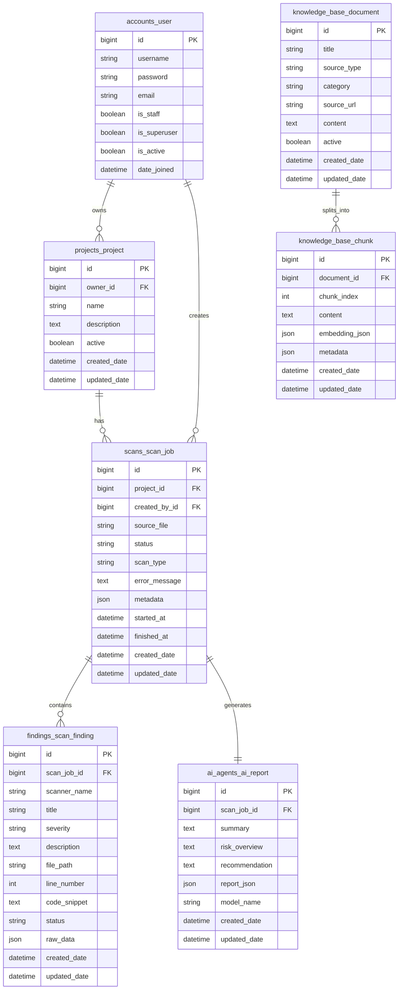

# Thiết kế cơ sở dữ liệu

Tài liệu này mô tả thiết kế cơ sở dữ liệu MVP của **AI DevSecOps Platform**. Mục tiêu là giữ schema đủ đơn giản để triển khai, nhưng vẫn hỗ trợ được luồng chính: tạo project, upload source code, tạo scan job, lưu findings và sinh AI report.

---

## 1. Nguyên tắc thiết kế

- Chỉ tạo các bảng cần thiết cho luồng nghiệp vụ chính.
- Không thêm field nếu chưa có nhu cầu sử dụng thật.
- Dữ liệu phụ hoặc dữ liệu linh hoạt được lưu bằng JSONField.
- Ưu tiên quan hệ rõ ràng giữa `User`, `Project`, `ScanJob`, `ScanFinding` và `AIReport`.
- Knowledge base phục vụ RAG được tách thành `KnowledgeDocument` và `KnowledgeChunk`.

Các trường JSON chính:

| Bảng | Trường JSON | Mục đích |
|---|---|---|
| `ScanJob` | `metadata` | Lưu tên file upload, detected stack, số lượng findings, scanner versions |
| `ScanFinding` | `raw_data` | Lưu dữ liệu gốc từ Semgrep, Trivy hoặc npm audit |
| `AIReport` | `report_json` | Lưu cấu trúc báo cáo AI ở dạng JSON |
| `KnowledgeChunk` | `embedding_json`, `metadata` | Lưu embedding tạm thời và metadata phục vụ RAG |

---

## 2. Danh sách bảng chính

### 2.1. `accounts_user`

Bảng lưu thông tin người dùng hệ thống. Model kế thừa `AbstractUser` của Django nên có sẵn các trường như `username`, `password`, `email`, `first_name`, `last_name`, `is_staff`, `is_superuser`, `is_active`, `last_login`, `date_joined`.

Trong MVP, hệ thống chỉ phân biệt:

- Admin: `is_staff=True` hoặc `is_superuser=True`.
- User thường: `is_staff=False`, `is_superuser=False`.

Không tạo thêm field `role` riêng để tránh phức tạp khi chưa cần thiết.

### 2.2. `projects_project`

| Trường | Ý nghĩa |
|---|---|
| `id` | Khóa chính |
| `owner_id` | Người sở hữu project |
| `name` | Tên project |
| `description` | Mô tả project |
| `active` | Trạng thái hoạt động, dùng cho soft delete |
| `created_date` | Thời gian tạo |
| `updated_date` | Thời gian cập nhật |

### 2.3. `scans_scan_job`

| Trường | Ý nghĩa |
|---|---|
| `id` | Khóa chính |
| `project_id` | Project được scan |
| `created_by_id` | Người tạo scan job |
| `source_file` | File source code được upload |
| `status` | Trạng thái scan job |
| `scan_type` | Loại scan: SAST, DEPENDENCY hoặc FULL |
| `error_message` | Thông báo lỗi nếu scan thất bại |
| `metadata` | Thông tin phụ của scan job |
| `started_at` | Thời gian bắt đầu xử lý |
| `finished_at` | Thời gian hoàn tất |
| `created_date` | Thời gian tạo |
| `updated_date` | Thời gian cập nhật |

Giá trị `status`:

```text
PENDING -> RUNNING -> COMPLETED
PENDING -> RUNNING -> FAILED
```

Ví dụ `metadata`:

```json
{
  "source_file_name": "vulnerable-app.zip",
  "extract_path": "storage/extracted/job_1",
  "detected_stack": {
    "primary_language": "Python",
    "framework": "Django",
    "package_manager": "pip",
    "confidence": 0.9
  },
  "severity_count": {
    "critical": 1,
    "high": 2,
    "medium": 4,
    "low": 3,
    "info": 0
  },
  "total_findings": 10
}
```

### 2.4. `findings_scan_finding`

| Trường | Ý nghĩa |
|---|---|
| `id` | Khóa chính |
| `scan_job_id` | Scan job chứa finding |
| `scanner_name` | Tên scanner, ví dụ `semgrep`, `trivy`, `npm_audit` |
| `title` | Tiêu đề finding |
| `severity` | Mức độ nghiêm trọng |
| `description` | Mô tả finding |
| `file_path` | File bị ảnh hưởng |
| `line_number` | Dòng code liên quan |
| `code_snippet` | Đoạn code liên quan |
| `status` | Trạng thái xử lý finding |
| `raw_data` | Dữ liệu gốc từ scanner |
| `created_date` | Thời gian tạo |
| `updated_date` | Thời gian cập nhật |

Giá trị `severity`:

```text
INFO, LOW, MEDIUM, HIGH, CRITICAL
```

Giá trị `status`:

```text
OPEN, FIXED, IGNORED
```

### 2.5. `ai_agents_ai_report`

| Trường | Ý nghĩa |
|---|---|
| `id` | Khóa chính |
| `scan_job_id` | Scan job được phân tích |
| `summary` | Tóm tắt kết quả phân tích |
| `risk_overview` | Tổng quan mức độ rủi ro |
| `recommendation` | Gợi ý khắc phục |
| `report_json` | Báo cáo chi tiết dạng JSON |
| `model_name` | Tên AI model sử dụng |
| `created_date` | Thời gian tạo |
| `updated_date` | Thời gian cập nhật |

Quan hệ giữa `ScanJob` và `AIReport` là 1-1 vì mỗi lần scan chỉ cần một báo cáo AI trong MVP.

### 2.6. `knowledge_base_document`

| Trường | Ý nghĩa |
|---|---|
| `id` | Khóa chính |
| `title` | Tiêu đề tài liệu |
| `source_type` | Loại nguồn tài liệu |
| `category` | Nhóm nội dung |
| `source_url` | Đường dẫn tham khảo nếu có |
| `content` | Nội dung tài liệu |
| `active` | Trạng thái hoạt động |
| `created_date` | Thời gian tạo |
| `updated_date` | Thời gian cập nhật |

Giá trị `source_type`:

```text
OWASP, CWE, SEMGREP_DOC, TRIVY_DOC, CUSTOM_NOTE, RUNBOOK
```

### 2.7. `knowledge_base_chunk`

| Trường | Ý nghĩa |
|---|---|
| `id` | Khóa chính |
| `document_id` | Tài liệu gốc |
| `chunk_index` | Thứ tự chunk trong tài liệu |
| `content` | Nội dung chunk |
| `embedding_json` | Embedding tạm thời trong MVP |
| `metadata` | Thông tin phụ của chunk |
| `created_date` | Thời gian tạo |
| `updated_date` | Thời gian cập nhật |

Trong giai đoạn sau, `embedding_json` có thể được thay bằng vector field nếu tích hợp `pgvector`.

---

## 3. ERD tổng quát



---

## 4. Các quan hệ quan trọng

| Quan hệ | Loại | Ý nghĩa |
|---|---|---|
| `User` - `Project` | 1-n | Một user có thể tạo nhiều project |
| `User` - `ScanJob` | 1-n | Một user có thể tạo nhiều scan job |
| `Project` - `ScanJob` | 1-n | Một project có thể được scan nhiều lần |
| `ScanJob` - `ScanFinding` | 1-n | Một scan job có thể sinh nhiều finding |
| `ScanJob` - `AIReport` | 1-1 | Một scan job có một báo cáo AI |
| `KnowledgeDocument` - `KnowledgeChunk` | 1-n | Một tài liệu được tách thành nhiều chunk |

---

## 5. Ràng buộc dữ liệu

- `Project.owner` là khóa ngoại đến `User`.
- `ScanJob.project` là khóa ngoại đến `Project`.
- `ScanJob.created_by` là khóa ngoại đến `User`.
- `ScanFinding.scan_job` là khóa ngoại đến `ScanJob`.
- `AIReport.scan_job` là quan hệ 1-1 đến `ScanJob`.
- `KnowledgeChunk.document` là khóa ngoại đến `KnowledgeDocument`.
- Các trường trạng thái như `ScanJob.status`, `ScanJob.scan_type`, `ScanFinding.severity`, `ScanFinding.status` dùng `TextChoices` để giới hạn giá trị hợp lệ.
- Các bảng nghiệp vụ chính có `created_date` và `updated_date` để theo dõi thời gian tạo/cập nhật.

---

## 6. Lý do rút gọn schema MVP

Ban đầu hệ thống có thể mở rộng thêm các bảng như `SourceUpload`, `ScanStep`, `SystemLog`, `Incident`, `IncidentAIReport`. Tuy nhiên, trong giai đoạn MVP, các bảng này chưa bắt buộc vì có thể làm hệ thống phức tạp sớm.

Do đó, thiết kế hiện tại tập trung vào luồng chính:

```text
User tạo Project
Project có nhiều ScanJob
ScanJob sinh nhiều ScanFinding
ScanJob có một AIReport
KnowledgeDocument được chia thành KnowledgeChunk để phục vụ RAG
```

Các phần như log analysis, incident analysis, monitoring, pgvector và cloud deployment được xem là hướng mở rộng sau khi MVP ổn định.
