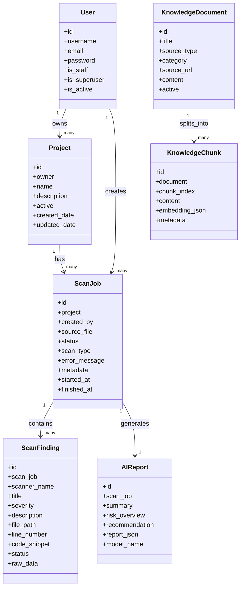
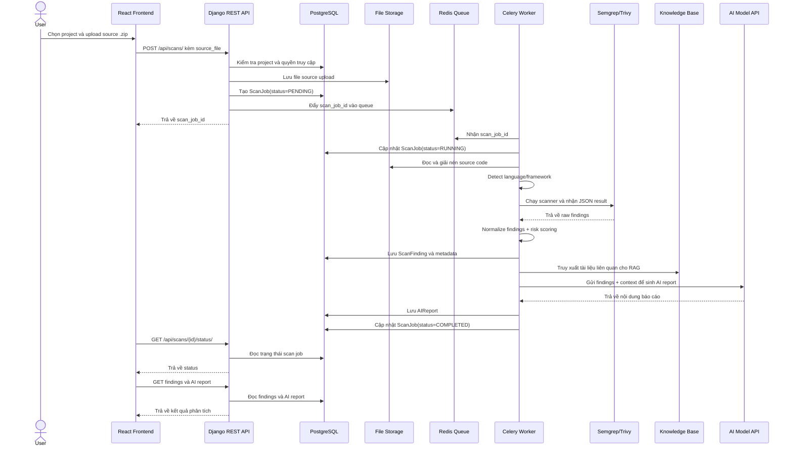
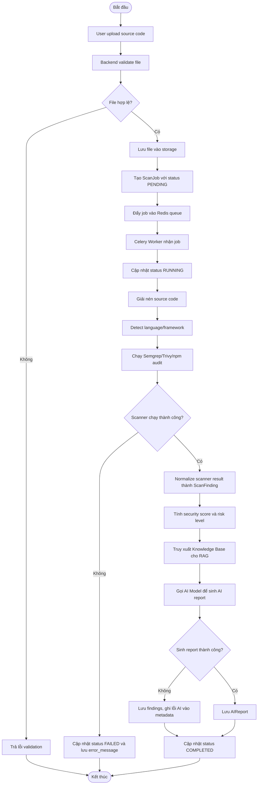
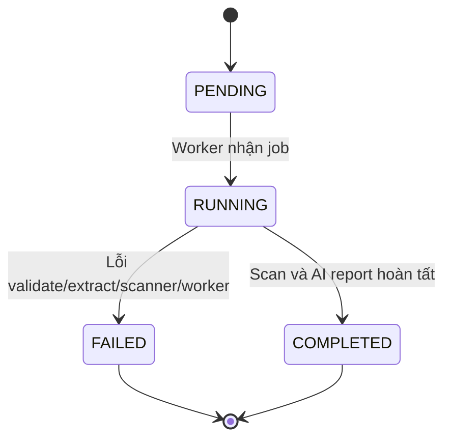
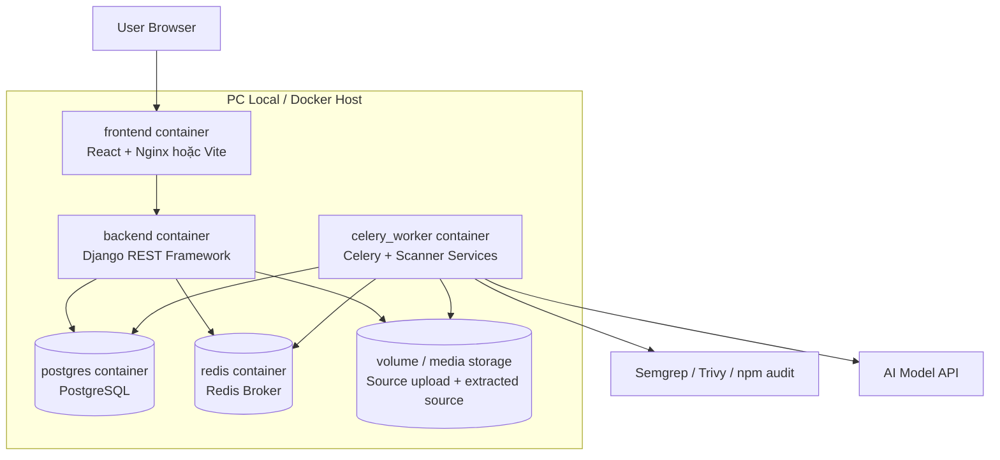

# Tổng hợp sơ đồ hệ thống

Tài liệu này tập hợp các sơ đồ chính dùng cho báo cáo đồ án **AI DevSecOps Platform**.

Các sơ đồ nên đưa vào Chương 3 của báo cáo:

- C4 Architecture Diagram: mô tả kiến trúc tổng thể.
- Use Case Diagram: mô tả chức năng hệ thống theo actor.
- ERD: mô tả cơ sở dữ liệu.
- UML Class Diagram: mô tả các entity/model chính.
- Sequence Diagram: mô tả trình tự xử lý use case upload source và scan.
- Activity Diagram: mô tả luồng xử lý scan job.
- State Diagram: mô tả trạng thái của `ScanJob`.
- Deployment Diagram: mô tả triển khai bằng Docker Compose.

---

## 1. Tài liệu liên quan

| Sơ đồ | File |
|---|---|
| C4 Level 1, 2, 3 | [`docs/C4.md`](C4.md) |
| Use Case | [`docs/use-case.md`](use-case.md) |
| ERD / Database Design | [`docs/database-design.md`](database-design.md) |

---

## 2. UML Class Diagram

Sơ đồ lớp tập trung vào các entity/model chính của hệ thống. Không đưa serializer, viewset hoặc service nhỏ vào sơ đồ này để tránh rối.

---

## 3. Sequence Diagram - Upload source code và scan

Sơ đồ tuần tự này mô tả use case cốt lõi: User upload source code, hệ thống tạo scan job, worker chạy scanner và sinh AI report.

---

## 4. Activity Diagram - Scan flow

Sơ đồ hoạt động mô tả luồng xử lý scan job trong worker.

---

## 5. State Diagram - ScanJob

`ScanJob` là đối tượng có trạng thái rõ nhất trong hệ thống.

---

## 6. Deployment Diagram - Docker Compose local

Trong MVP, hệ thống được triển khai local bằng Docker Compose để dễ demo, dễ debug và mô phỏng kiến trúc thực tế.

---

## 7. Ghi chú sử dụng trong báo cáo

- C4 dùng cho mục **3.2 Kiến trúc hệ thống**.
- Use Case dùng cho mục **3.3 Phân tích sơ đồ use case hệ thống**.
- Class Diagram, Sequence Diagram, Activity Diagram và State Diagram dùng cho mục **3.4 Mô hình hoá hệ thống**.
- ERD dùng cho mục **3.5 Thiết kế cơ sở dữ liệu hệ thống**.
- Deployment Diagram dùng cho mục **3.7.1 Triển khai hệ thống**.
