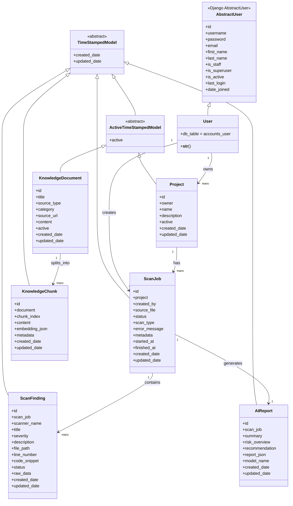
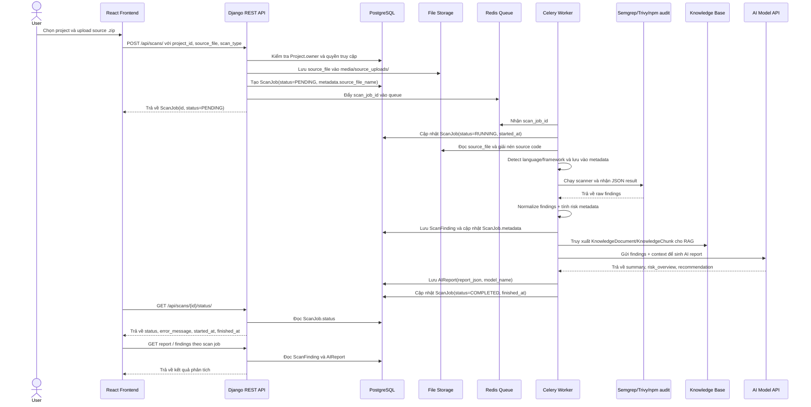
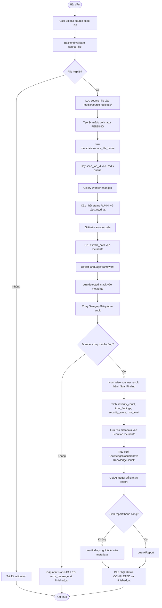
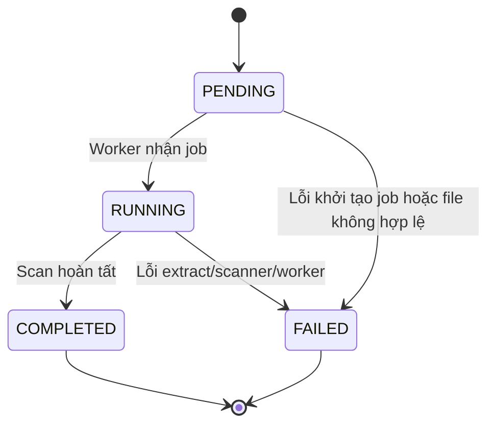
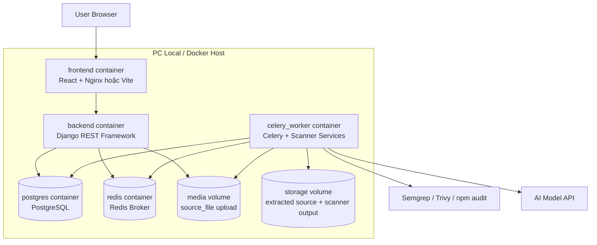

# Tổng hợp sơ đồ hệ thống

Tài liệu này tập hợp các sơ đồ chính dùng cho báo cáo đồ án **AI DevSecOps Platform**.

Nội dung trong tài liệu này được đối chiếu với các model backend hiện tại của hệ thống, bao gồm:

```text
accounts.User
projects.Project
scans.ScanJob
findings.ScanFinding
ai_agents.AIReport
knowledge_base.KnowledgeDocument
knowledge_base.KnowledgeChunk
```

Các sơ đồ nên đưa vào Chương 3 của báo cáo:

- C4 Architecture Diagram: mô tả kiến trúc tổng thể.
- Use Case Diagram: mô tả chức năng hệ thống theo actor.
- ERD: mô tả cơ sở dữ liệu.
- UML Class Diagram: mô tả các entity/model chính.
- Sequence Diagram: mô tả trình tự xử lý use case upload source và scan.
- Activity Diagram: mô tả luồng xử lý scan job.
- State Diagram: mô tả trạng thái của `ScanJob`.
- Deployment Diagram: mô tả triển khai bằng Docker Compose.

---

## 1. Tài liệu liên quan

| Sơ đồ | File |
|---|---|
| C4 Level 1, 2, 3 | [`docs/C4.md`](C4.md) |
| Use Case | [`docs/use-case.md`](use-case.md) |
| ERD / Database Design | [`docs/database-design.md`](database-design.md) |

---

## 2. UML Class Diagram

Sơ đồ lớp tập trung vào các entity/model chính của hệ thống. Không đưa serializer, viewset hoặc service nhỏ vào sơ đồ này để tránh rối.

Các model `Project` và `KnowledgeDocument` kế thừa `ActiveTimeStampedModel`, nên có thêm các field `active`, `created_date`, `updated_date`. Các model `ScanJob`, `ScanFinding`, `AIReport` và `KnowledgeChunk` kế thừa `TimeStampedModel`, nên có thêm `created_date`, `updated_date`.



### 2.1. Giá trị enum quan trọng

Các field dạng trạng thái trong backend dùng `TextChoices` để giới hạn giá trị hợp lệ.

| Model | Field | Giá trị |
|---|---|---|
| `ScanJob` | `status` | `PENDING`, `RUNNING`, `COMPLETED`, `FAILED` |
| `ScanJob` | `scan_type` | `SAST`, `DEPENDENCY`, `FULL` |
| `ScanFinding` | `severity` | `INFO`, `LOW`, `MEDIUM`, `HIGH`, `CRITICAL` |
| `ScanFinding` | `status` | `OPEN`, `FIXED`, `IGNORED` |
| `KnowledgeDocument` | `source_type` | `OWASP`, `CWE`, `SEMGREP_DOC`, `TRIVY_DOC`, `CUSTOM_NOTE`, `RUNBOOK` |

Ghi chú: `accounts.User` kế thừa `AbstractUser` của Django. Một số field mặc định như `groups` và `user_permissions` vẫn tồn tại theo Django Auth, nhưng không đưa vào sơ đồ chính để giữ diagram gọn và tập trung vào nghiệp vụ MVP.

---

## 3. Sequence Diagram - Upload source code và scan

Sơ đồ tuần tự này mô tả use case cốt lõi: User upload source code, hệ thống tạo `ScanJob`, worker chạy scanner và sinh AI report.

Trong backend hiện tại, API upload tạo `ScanJob` với:

```text
source_file -> lưu file upload
status -> PENDING
scan_type -> SAST / DEPENDENCY / FULL
metadata.source_file_name -> tên file upload
```



Ghi chú: các bước từ Redis, Celery Worker, scanner và AI report là luồng kiến trúc mục tiêu. Nếu chưa tích hợp worker, hệ thống dừng ở bước tạo `ScanJob(status=PENDING)` sau khi upload.

---

## 4. Activity Diagram - Scan flow

Sơ đồ hoạt động mô tả luồng xử lý scan job trong worker. Các kết quả như `severity_count`, `total_findings`, `extract_path`, `detected_stack`, `security_score` hoặc `risk_level` nên lưu trong `ScanJob.metadata` vì backend hiện chưa có field riêng cho các giá trị này.



---

## 5. State Diagram - ScanJob

`ScanJob` là đối tượng có trạng thái rõ nhất trong hệ thống. Field `status` trong backend hiện có 4 giá trị: `PENDING`, `RUNNING`, `COMPLETED`, `FAILED`.



---

## 6. Deployment Diagram - Docker Compose local

Trong MVP, hệ thống được triển khai local bằng Docker Compose để dễ demo, dễ debug và mô phỏng kiến trúc thực tế.



---

## 7. Ghi chú sử dụng trong báo cáo

- C4 dùng cho mục **3.2 Kiến trúc hệ thống**.
- Use Case dùng cho mục **3.3 Phân tích sơ đồ use case hệ thống**.
- Class Diagram, Sequence Diagram, Activity Diagram và State Diagram dùng cho mục **3.4 Mô hình hoá hệ thống**.
- ERD dùng cho mục **3.5 Thiết kế cơ sở dữ liệu hệ thống**.
- Deployment Diagram dùng cho mục **3.7.1 Triển khai hệ thống**.
- Các diagram trong tài liệu này phản ánh model backend hiện tại. Nếu sau này thêm field thật như `security_score`, `risk_level`, `language`, `framework` hoặc bảng `SourceUpload`, cần cập nhật lại diagram tương ứng.
