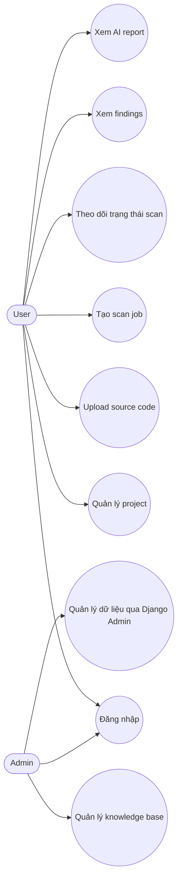

# Phân tích Use Case

Tài liệu này mô tả các actor và use case chính của **AI DevSecOps Platform** trong phạm vi MVP.

---

## 1. Actor

| Actor | Mô tả |
|---|---|
| Admin | Người quản trị hệ thống, có quyền quản lý dữ liệu toàn hệ thống và knowledge base |
| User | Người dùng thông thường, có thể tạo project, upload source code, tạo scan job và xem kết quả của chính mình |

Trong MVP, phân quyền Admin/User được triển khai dựa trên cơ chế mặc định của Django:

- Admin: `is_staff=True` hoặc `is_superuser=True`.
- User thường: `is_staff=False`, `is_superuser=False`.

---

## 2. Danh sách use case

| Mã use case | Tên use case | Actor chính | Mức ưu tiên MVP |
|---|---|---|---|
| UC01 | Đăng nhập hệ thống | Admin, User | Cao |
| UC02 | Quản lý project | User | Cao |
| UC03 | Upload source code và tạo scan job | User | Cao |
| UC04 | Theo dõi trạng thái scan job | User | Cao |
| UC05 | Xem findings | User | Cao |
| UC06 | Xem AI report | User | Cao |
| UC07 | Quản lý knowledge base | Admin | Trung bình |
| UC08 | Quản lý dữ liệu hệ thống qua Django Admin | Admin | Trung bình |

---

## 3. Use Case Diagram

---

## 4. Đặc tả use case quan trọng

### 4.1. UC02 - Quản lý project

| Trường | Nội dung |
|---|---|
| Use case ID | UC02 |
| Tên use case | Quản lý project |
| Actor chính | User |
| Actor phụ | Admin |
| Mô tả vắn tắt | Người dùng tạo và quản lý project source code của mình |
| Tiền điều kiện | Người dùng đã đăng nhập |
| Hậu điều kiện | Project được tạo/cập nhật/xóa mềm trong hệ thống |

**Luồng hoạt động chính:**

1. User truy cập trang quản lý project.
2. Hệ thống hiển thị danh sách project thuộc về user.
3. User nhập thông tin project mới.
4. Hệ thống kiểm tra dữ liệu đầu vào.
5. Hệ thống tạo project và gán `owner` là user hiện tại.
6. Hệ thống trả về thông tin project vừa tạo.

**Luồng thay thế:**

- User cập nhật tên hoặc mô tả project.
- User xóa project. Hệ thống thực hiện soft delete bằng `active=False`.

**Luồng ngoại lệ:**

- Nếu user chưa đăng nhập, hệ thống trả về lỗi xác thực.
- Nếu dữ liệu không hợp lệ, hệ thống trả về lỗi validation.

---

### 4.2. UC03 - Upload source code và tạo scan job

| Trường | Nội dung |
|---|---|
| Use case ID | UC03 |
| Tên use case | Upload source code và tạo scan job |
| Actor chính | User |
| Actor phụ | Celery Worker, Scanner Runtime |
| Mô tả vắn tắt | User upload source code dạng `.zip`, hệ thống tạo scan job để xử lý bất đồng bộ |
| Tiền điều kiện | User đã đăng nhập và đã có project |
| Hậu điều kiện | ScanJob được tạo với trạng thái `PENDING` |

**Luồng hoạt động chính:**

1. User chọn project cần scan.
2. User upload source code dạng `.zip`.
3. Backend API kiểm tra quyền truy cập project.
4. Backend API lưu file vào `MEDIA_ROOT`.
5. Backend API tạo `ScanJob` với trạng thái `PENDING`.
6. Backend API đẩy job vào Redis queue.
7. Hệ thống trả về `scan_job_id` cho user.
8. Celery Worker xử lý scan job ở background.

**Luồng thay thế:**

- Nếu chưa tích hợp Celery, hệ thống chỉ tạo `ScanJob(PENDING)` để kiểm thử upload API.

**Luồng ngoại lệ:**

- File không đúng định dạng `.zip`.
- User không có quyền truy cập project.
- File upload vượt quá giới hạn dung lượng.
- Lỗi lưu file hoặc lỗi tạo scan job.

---

### 4.3. UC04 - Theo dõi trạng thái scan job

| Trường | Nội dung |
|---|---|
| Use case ID | UC04 |
| Tên use case | Theo dõi trạng thái scan job |
| Actor chính | User |
| Actor phụ | Celery Worker |
| Mô tả vắn tắt | User xem trạng thái hiện tại của một scan job |
| Tiền điều kiện | User đã tạo scan job hoặc có quyền xem scan job |
| Hậu điều kiện | User biết scan job đang chờ, đang chạy, hoàn tất hay thất bại |

**Luồng hoạt động chính:**

1. User mở chi tiết scan job.
2. Frontend gọi API lấy trạng thái scan job.
3. Backend kiểm tra quyền truy cập.
4. Backend trả về trạng thái hiện tại: `PENDING`, `RUNNING`, `COMPLETED` hoặc `FAILED`.
5. Frontend hiển thị trạng thái cho user.

**Luồng ngoại lệ:**

- Scan job không tồn tại.
- User không có quyền xem scan job.

---

### 4.4. UC05 - Xem findings

| Trường | Nội dung |
|---|---|
| Use case ID | UC05 |
| Tên use case | Xem findings |
| Actor chính | User |
| Actor phụ | Scanner Runtime |
| Mô tả vắn tắt | User xem danh sách rủi ro/lỗi được scanner phát hiện |
| Tiền điều kiện | Scan job đã hoàn tất hoặc đã có findings |
| Hậu điều kiện | User xem được danh sách findings và mức độ nghiêm trọng |

**Luồng hoạt động chính:**

1. User mở trang kết quả scan.
2. Frontend gọi API lấy danh sách findings theo scan job.
3. Backend kiểm tra quyền truy cập.
4. Backend trả về danh sách findings.
5. Frontend hiển thị findings theo severity, file path và dòng code.

**Luồng thay thế:**

- User lọc findings theo severity.

**Luồng ngoại lệ:**

- Scan job chưa hoàn tất.
- Không có finding nào được phát hiện.

---

### 4.5. UC06 - Xem AI report

| Trường | Nội dung |
|---|---|
| Use case ID | UC06 |
| Tên use case | Xem AI report |
| Actor chính | User |
| Actor phụ | AI Model API, LangChain/RAG |
| Mô tả vắn tắt | User xem báo cáo AI giải thích findings và gợi ý khắc phục |
| Tiền điều kiện | Scan job đã có findings và AIReport đã được sinh |
| Hậu điều kiện | User đọc được summary, risk overview và recommendation |

**Luồng hoạt động chính:**

1. User mở trang AI report của scan job.
2. Frontend gọi API lấy AI report.
3. Backend kiểm tra quyền truy cập.
4. Backend trả về `summary`, `risk_overview`, `recommendation` và `report_json`.
5. Frontend hiển thị báo cáo AI.

**Luồng ngoại lệ:**

- AI report chưa được sinh.
- AI model lỗi trong quá trình sinh báo cáo.
- User không có quyền xem scan job.

---

### 4.6. UC07 - Quản lý knowledge base

| Trường | Nội dung |
|---|---|
| Use case ID | UC07 |
| Tên use case | Quản lý knowledge base |
| Actor chính | Admin |
| Actor phụ | RAG Service |
| Mô tả vắn tắt | Admin thêm và quản lý tài liệu bảo mật dùng cho RAG |
| Tiền điều kiện | Admin đã đăng nhập |
| Hậu điều kiện | KnowledgeDocument và KnowledgeChunk được tạo/cập nhật |

**Luồng hoạt động chính:**

1. Admin truy cập trang quản lý knowledge base.
2. Admin thêm tài liệu mới như OWASP, CWE hoặc ghi chú nội bộ.
3. Hệ thống lưu `KnowledgeDocument`.
4. Hệ thống tách tài liệu thành nhiều `KnowledgeChunk`.
5. RAG Service sử dụng các chunk này để truy xuất context khi sinh AI report.

**Luồng ngoại lệ:**

- Nội dung tài liệu rỗng.
- Admin nhập sai loại source type.
